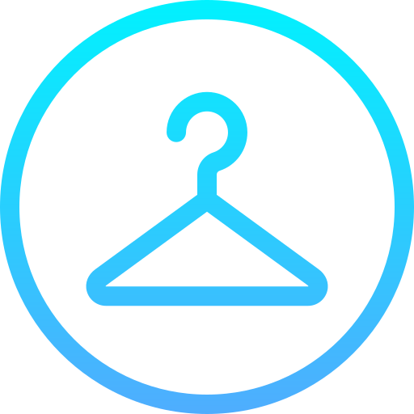

### Image Credits

1. Workspace/wireapps-clothes_store_prototype/src/assets/images/favicon-logo.png =>

  <kbd>
    
  </kbd>

  Figure 1.1: Image by <a href="https://www.flaticon.com/free-icons/clothes">Clothes icons created by Uniconlabs - Flaticon</a>

2. Workspace/wireapps-clothes_store_prototype/src/assets/loading-spinner/ring-loading-spinner.svg =>

  <kbd>
    
  </kbd>

  Figure 2.1: <a href="https://loading.io/spinner/dual-ring/-disqus-ring-donut-rotate">Dual Ring from loading.io</a>

