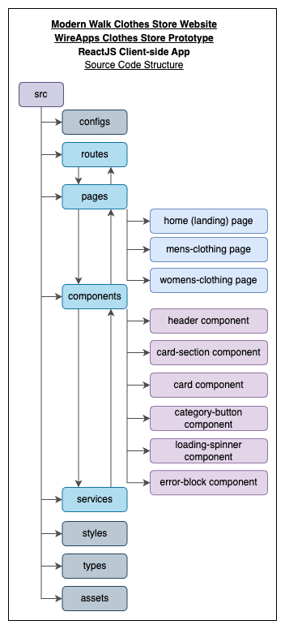
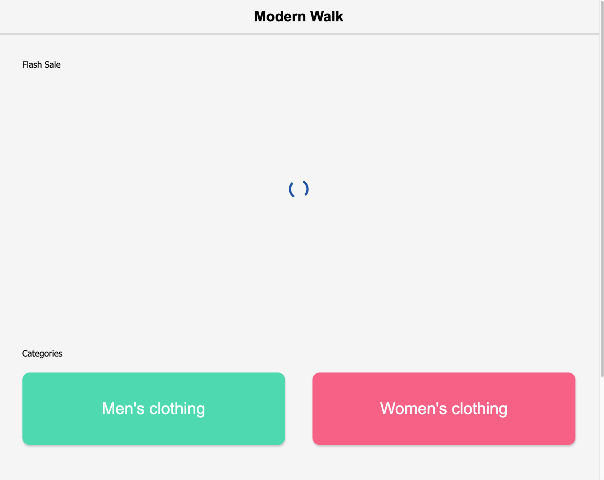
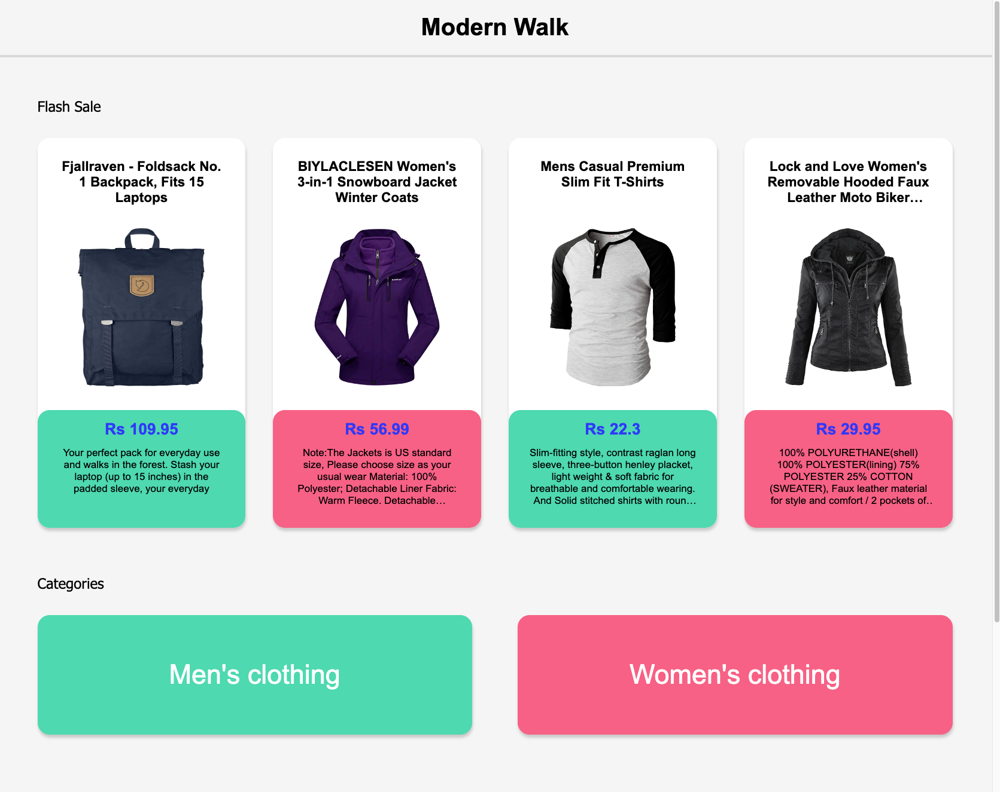
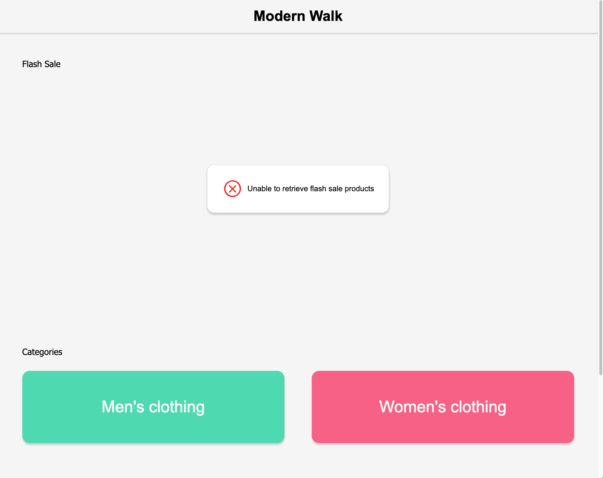
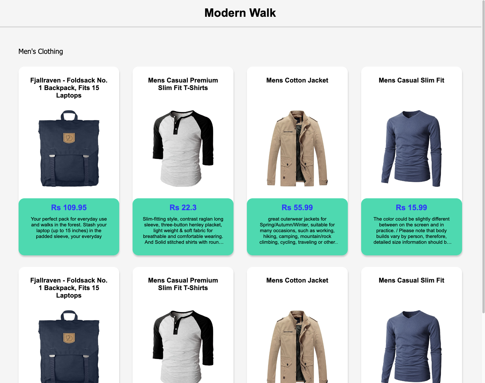
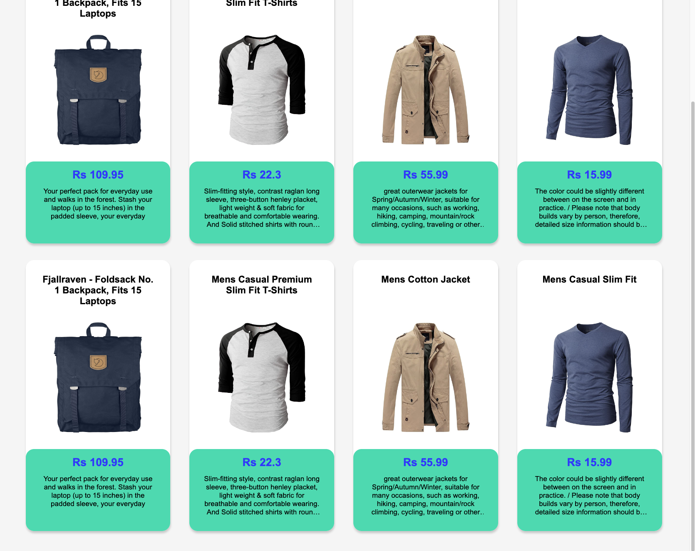
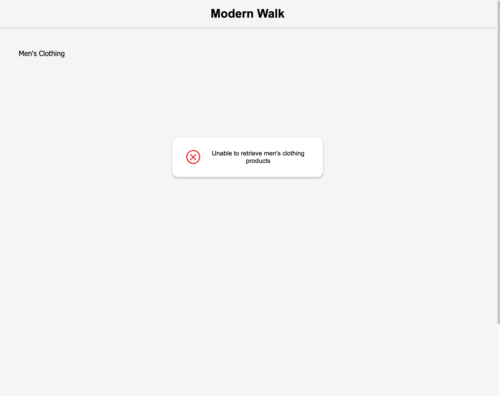
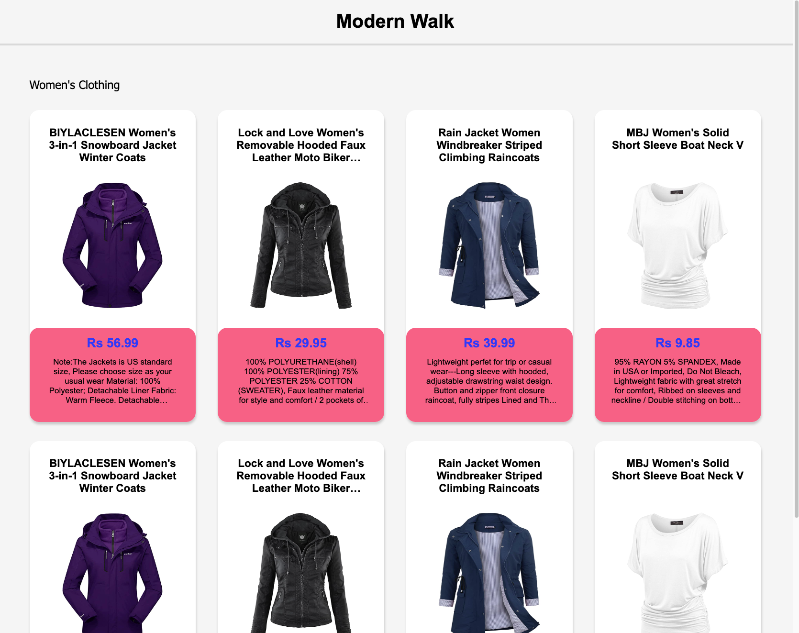
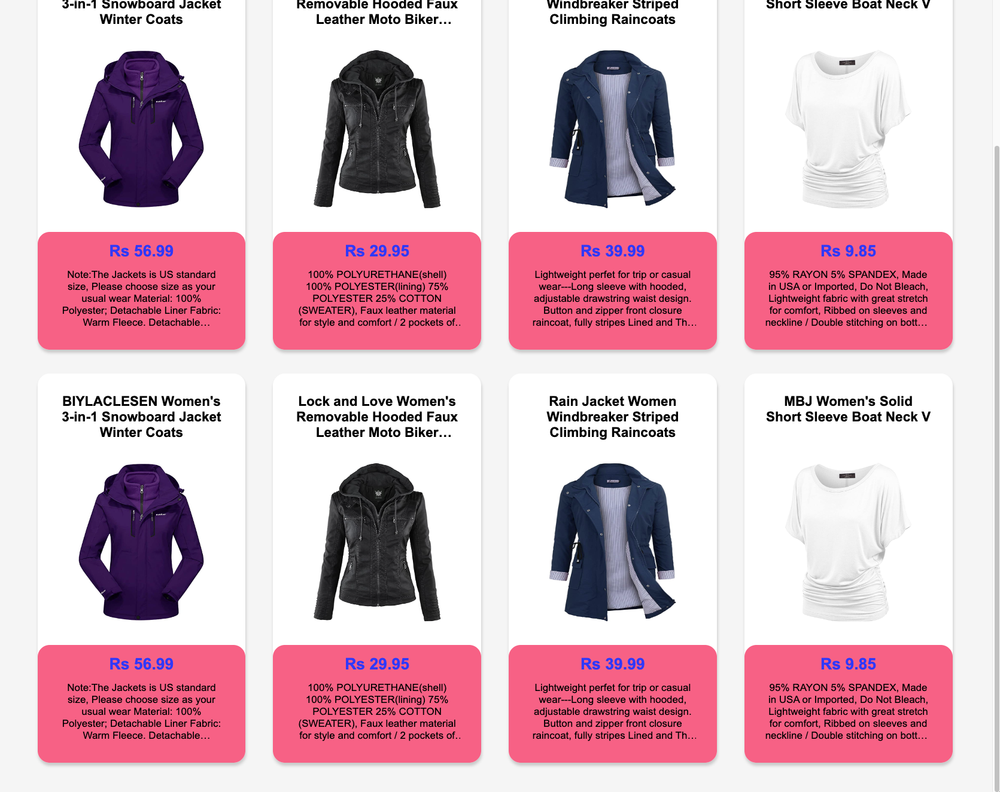

<h1>WireApps - Entry Coding Exercise</h1>

### WireApps - Clothes Store Prototype

## Table of Contents

[1. App Description](#1-app-description--)<br>
[2. System Architecture](#2-system-architecture--)<br>
[3. Consumed Technologies, Tools and Dependencies](#3-consumed-technologies-tools-and-dependencies--)<br>
[4. Installation](#4-installation--)<br>
[5. Managing the Source Code](#5-managing-the-source-code--)<br>
[6. Usage](#6-usage--)<br>
  &nbsp;&nbsp;&nbsp;&nbsp;[6.1. Functional features](#61-functional-features--)<br>
  &nbsp;&nbsp;&nbsp;&nbsp;[6.2. Non-functional features](#62-non-functional-features--)<br>
  &nbsp;&nbsp;&nbsp;&nbsp;[6.3. Screenshots of Modern Walk Clothes Store](#63-screenshots-of-modern-walk-clothes-store--)<br>
[7. Git Commit Strategy](#7-git-commit-strategy--)<br>
[8. Credits](#8-credits--)<br>
[9. License](#9-license--)<br>

## Documentation

### 1. App Description -
This is a prototype web application built to showcase the use cases of a e-commerce clothing store. Engaging with end users in viewing flash sale deals, men's and women's clothing selections.
This prototype web application consists of three web page,
1. Home page => Users can view the latest items with offers and redirect to the "Men's clothing" and "Women's clothing" web pages.
2. Men's clothing page => Users can view a selection of clothing items targeted towards men with the necessary item details, like name, image, price and description.
3. Women's clothing page => Users can view a selection of clothing items targeted towards women with the necessary item details, like name, image, price and description.

<hr>

### 2. System Architecture -
<p align="center">
  <kbd>
    
  </kbd>
</p>
<p align="center">Figure 2.1: System Architecture Diagram</p>

This system operates with a flow od data using the Client/server architecture.
* The Client-side, ReadJS app, request data from the Server-side Express (NodeJS) app through the REST API.
* The Server-side app will query the data store (database) with the passed parameters and return the requests data as a response.
* [The current project only contains the front-end, whereas the back-end and the database is handled by a third-party developer.]

<hr>

### 3. Consumed Technologies, Tools and Dependencies -
* Programming Languages -
  * Client-side (Front-end) - ReactJS, Sass, TypeScript, TSX
* Frameworks -
  * Facebook's [React](https://react.dev) using [React Hooks](https://react.dev/reference/react)
* Tools - [Visual Studio Code](https://code.visualstudio.com)
* Main Dependencies
  * [Axios](https://github.com/axios/axios) - Allows to fetch data from an API service.
  * [React-icons](https://react-icons.github.io/react-icons) - Icon library containing all the third-party icon packs.

<hr>

### 4. Installation -
To run the front-end application, it's node modules are required.<br>
1. To download the node modules, go to the project file directory via the command prompt (CMD) and run the below command =>
```terminal
npm install
```
2. After the node modules are installed, to run the app, run the below command =>
```terminal
npm start
```

<hr>

### 5. Managing the Source Code -
Client-side app's source code is located in the following directory =>
```
Workspace -> wireapps-clothes-store-prototype
```
Source code structure =>
<p align="center">
  <kbd>
    
  </kbd>
</p>
<p align="center">Figure 5.5: Client-side app Source Code Structure</p>

<hr>

### 6. Usage -

  #### 6.1. Functional features -
  * End users can view products from the flash sale on Men's and Women's clothing.
  * End users can view distinctive products by Men's and Women's clothing categories.
  * End users can view a properties of each clothing product, like,
    * Title
    * Image
    * Price
    * Description

  <hr>

  #### 6.2. Non-functional features -
  * Code Readability
  * Code Reusability
  * Code Maintainability
  * Code Scalability
  * Error Handling

  <hr>

  #### 6.3. Screenshots of Modern Walk Clothes Store -

  ##### 6.3.1. Loading state example -
  <p align="center">
    <kbd>
      
    </kbd>
  </p>
  <p align="center">Figure 6.3.1.1: Home (Landing) page - Loading state example screenshot</p>

  ##### 6.3.2. Home (Landing) page -
  <p align="center">
    <kbd>
      
    </kbd>
  </p>
  <p align="center">Figure 6.3.2.1: Home (Landing) page screenshot</p>

  <p align="center">
    <kbd>
      
    </kbd>
  </p>
  <p align="center">Figure 6.3.2.2: Home (Landing) page - Error state screenshot</p>

  ##### 6.3.3. Men's Clothing page -
  <p align="center">
    <kbd>
      
    </kbd>
  </p>
  <p align="center">Figure 6.3.3.1: Men's Clothing page screenshot 1</p>

  <p align="center">
    <kbd>
      
    </kbd>
  </p>
  <p align="center">Figure 6.3.3.2: Men's Clothing page (cont.) screenshot 2</p>

  <p align="center">
    <kbd>
      
    </kbd>
  </p>
  <p align="center">Figure 6.3.3.3: Men's Clothing page - Error state screenshot</p>

  ##### 6.3.4. Women's Clothing page -
  <p align="center">
    <kbd>
      
    </kbd>
  </p>
  <p align="center">Figure 6.3.4.1: Women's Clothing page screenshot 1</p>

  <p align="center">
    <kbd>
      
    </kbd>
  </p>
  <p align="center">Figure 6.3.4.2: Women's Clothing page (cont.) screenshot 2</p>

  <p align="center">
    <kbd>
      
    </kbd>
  </p>
  <p align="center">Figure 6.3.4.3: Women's Clothing page - Error state screenshot</p>

<hr>

## 7. Git Commit Strategy -
This repository contains two branches, "main" and "develop". During the development process of the source code and documentation, change commit were pushed to the "develop" branch.
After a portion of the development was complete, it was reviewed and merged into the "main" branch.
Changes were pushed as commits incrementally as shown in the table below,
| Version | Commit Group |
|---------|--------------|
| v1 | Group 1 - Documentation |
| v1 | Group 2 - Front-end |

<hr>

## 8. Credits -
This project was developed as a clothing e-commerce prototype website for the entry evaluation process at WireApps. This functional requirements were provided by WireApps.<br>
The project was worked on using the best practices and guidance with the use of legitimate online documentation (docs) and YouTube videos.<br>
Documentation and source code in this repository was developed by H.V.L.Hasanka.

Extended credits => <a href="./Image-Credits.md">Image credits</a>

<hr>

## 9. License -
Copyright (c) 2023 H.V.L.Hasanka<br>
Licensed under MIT License
